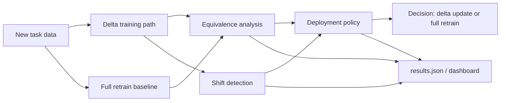

# Delta Framework

[](https://www.python.org/)
[](https://pytorch.org/)
[](#launch-the-web-app)
[](#what-it-does)
[](LICENSE)

**Delta Framework** is a **shift-aware class-incremental learning framework** for answering one practical question:

> **Can we safely update a model with new data, or do we need to fully retrain it?**

Instead of only training an incremental model, Delta Framework:
- trains a **delta update path**
- trains a **full retrain baseline**
- measures the **equivalence gap**
- detects **distribution / representation shift**
- applies a **deployment policy** to recommend `delta_update` or `full_retrain`

The web app is only the demo layer. The actual framework lives in `delta_framework/`.

## What it does

Delta Framework is built for **class-incremental image classification**.

For every incoming task:
1. the model is updated incrementally using replay, distillation, and weight alignment
2. a full retrain baseline is trained on all seen classes
3. both paths are compared with accuracy, calibration, and robustness-style metrics
4. feature drift is measured to detect shift
5. a policy decides whether the delta update is safe enough to deploy

So this is not just "an ML model" or "a dashboard" - it is a **benchmarking + evaluation + decision framework** for update-vs-retrain.

## Core components

| Component | Purpose |
| --- | --- |
| `delta_framework/core/trainer.py` | Incremental training path and full-retrain baseline |
| `delta_framework/core/benchmarker.py` | End-to-end benchmark loop and result writing |
| `delta_framework/core/equivalence.py` | Gap analysis between delta and full retrain |
| `delta_framework/core/shift_detector.py` | Representation shift detection |
| `delta_framework/core/bounds.py` | Theoretical deviation bound |
| `delta_framework/core/policy.py` | Deployment decision logic |
| `delta_framework/api.py` | Public Python API |
| `delta_framework/web/server.py` | Lightweight backend for the demo app |

## Framework architecture



## Why it is useful

- **Reduces retraining cost** by testing whether cheaper incremental updates are enough
- **Measures risk explicitly** instead of assuming every update is safe
- **Separates method from presentation** so others can use it as a library, CLI, or web app
- **Supports ablations** to compare replay-only, replay+KD, and other variants
- **Creates reproducible artifacts** in `results.json`

## Install

### Base package

```bash
pip install -e .
```

### Full framework runtime

```bash
pip install -e ".[app]"
```

### Optional extras

- ML runtime only:

```bash
pip install -e ".[ml]"
```

- Legacy Streamlit demo only:

```bash
pip install -e ".[ui]"
```

## Quick start

### Run from Python

```python
from delta_framework.api import BenchmarkConfig, TrainConfig, run

config = BenchmarkConfig(
    dataset="CIFAR-10",
    num_tasks=2,
    classes_per_task=5,
    prefer_cuda=False,
    train=TrainConfig(
        backbone="resnet32",
        epochs=1,
        batch_size=64,
        num_workers=0,
        use_replay=True,
        use_kd=True,
        use_weight_align=True,
    ),
)

results = run(config, results_path="results.json")
print(results["final_summary"])
```

### Run from CLI

```bash
python -m delta_framework.experiments.run_experiment \
  --dataset CIFAR-10 \
  --num-tasks 2 \
  --classes-per-task 5 \
  --epochs 1 \
  --batch-size 64 \
  --num-workers 0 \
  --results-path results.json
```

### Launch the web app

```bash
python -m delta_framework.web.server
```

Then open:

```text
http://127.0.0.1:8080
```

The web app now has separate pages for:
- **Setup**
- **Live Run**
- **Results**

## How other users can use the framework

Other users do **not** need to edit the internals.

They can use Delta Framework in 3 ways:

1. **As a Python library**
   - import `BenchmarkConfig`, `TrainConfig`, and `run` from `delta_framework.api`
2. **As a CLI benchmark tool**
   - run `python -m delta_framework.experiments.run_experiment ...`
3. **As a web demo**
   - run `python -m delta_framework.web.server`

For a complete step-by-step guide, see:

- [`docs/USAGE.md`](docs/USAGE.md)

## Demo presets

### Fast demo

Best for judges or quick testing:

- dataset: `CIFAR-10`
- tasks: `2`
- epochs: `1`
- workers: `0`
- ablations: `off`

### Balanced run

Good middle ground:

- dataset: `CIFAR-100`
- tasks: `5`
- epochs: `2`
- workers: `0`

### Full PS-style run

Best for a serious benchmark, but slower:

- dataset: `CIFAR-100`
- tasks: `5`
- epochs: `3`
- ablations: `on`

## Output artifacts

The framework writes `results.json`, which contains:

- current run status
- task-by-task delta metrics
- task-by-task full retrain metrics
- equivalence summaries
- shift scores
- deployment decisions
- optional ablation results
- final summary metrics

It also writes `experiment.log` during active runs.

## Project map

```text
delta_framework/
  api.py
  core/
    trainer.py
    benchmarker.py
    equivalence.py
    shift_detector.py
    bounds.py
    policy.py
  experiments/
    run_experiment.py
  web/
    server.py
    static/
      index.html
      monitor.html
      results.html
      app.js
      styles.css
  resnet.py
docs/
  USAGE.md
ui/
  app.py
tests/
README.md
pyproject.toml
```

## Current claim

This project does **not** claim literal parameter-level equivalence to full retraining.

The honest claim is:

- it measures how close the incremental update is to full retraining
- it estimates a theoretical deviation bound
- it detects shift
- it recommends whether the update is safe to deploy

That is a stronger and more defensible framing than saying "incremental update always equals retraining."

## Development

```bash
python -m ruff check .
python -m pytest
```

## Acknowledgments

- [PyTorch](https://pytorch.org/)
- [continuum](https://github.com/Continvvm/continuum)
- class-incremental learning / replay / distillation / weight-alignment literature
